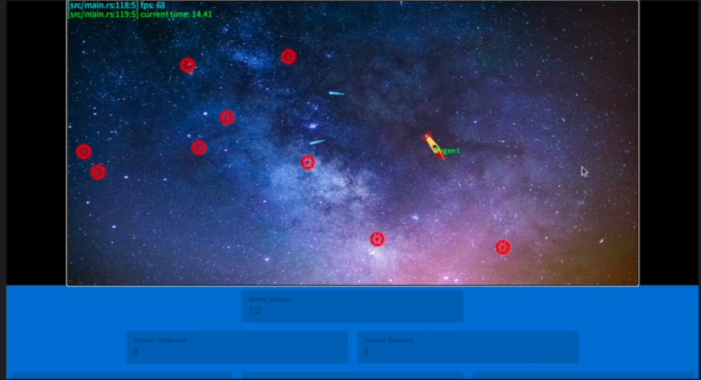
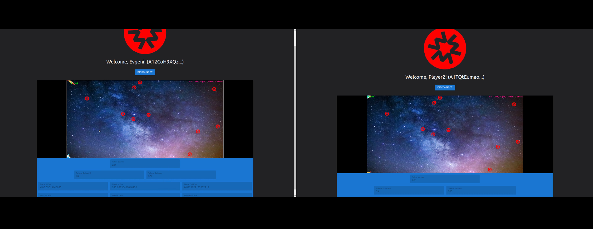

# starship-game
Decentralized game server example on the Massa Blockchain

There are separate READMEs for each of the game components:
- [smart-contracts](./smart_contracts/README.md)
- [game-engine](./game-decentralized-bevy/README.md)
- [dApp](./game-decentralized-bevy/dApp/README.md)

To get the game running, make sure you go through their READMEs in the order specified above.

**NOTE**: currently the game only runs on innonet v13 of the protocol.